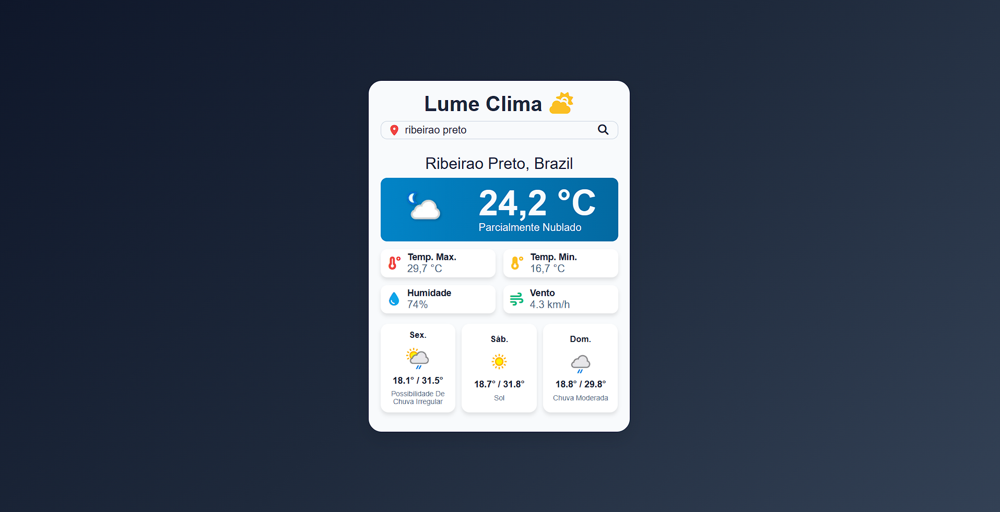

# 🌤️ Lume | Clima em Tempo Real

O **Lume** é uma aplicação web minimalista e funcional desenvolvida para fornecer informações meteorológicas precisas de cidades em todo o mundo. Utilizando a API do [WeatherAPI](https://www.weatherapi.com/), o projeto foca em uma experiência de usuário direta, rápida e com um design moderno.

---

## 🔗 Demonstração
Você pode acessar o projeto rodando em tempo real aqui:
👉 **[CLIQUE AQUI PARA ACESSAR O LUME](https://lume-clima.vercel.app/)**

---

## 📸 Preview do Projeto



---

## 🚀 Tecnologias Utilizadas

Este projeto foi construído utilizando as ferramentas mais modernas do ecossistema Front-end:

*   **[Vite](https://vitejs.dev/)**: Ferramenta de build de última geração para um desenvolvimento rápido.
*   **JavaScript (ES6+)**: Lógica assíncrona para consumo de API.
*   **CSS3**: Estilização moderna com foco em responsividade.
*   **OpenWeather API**: Fonte de dados meteorológicos globais.
*   **Vercel**: Plataforma de deployment e hospedagem.

---

## ✨ Funcionalidades

*   **Busca por Cidade**: Pesquisa instantânea de dados climáticos.
*   **Dados Detalhados**: Exibição de temperatura atual, máxima, mínima, umidade e velocidade do vento.
*   **Interface Adaptativa**: O fundo e os ícones mudam de acordo com as condições climáticas.
*   **Tratamento de Erros**: Feedback visual caso a cidade não seja encontrada.
*   **Segurança**: Uso de variáveis de ambiente (`.env`) para proteção de chaves de API.

---

## 🛠️ Como rodar o projeto localmente

Se desejar testar o projeto na sua máquina:

1. **Clone o repositório:**
   ```bash
   git clone [https://github.com/gerson-bruno/lume-clima.git](https://github.com/gerson-bruno/lume-clima.git)
   ```
2. **Instale as dependências:**
    ```bash 
    npm install
    ```
3. **Configure a API Key:**
Crie um aqrquivo .env na raiz do projeto com a chave da API do OpenWeatherMap.
    ```bash
    VITE_WEATHER_API_KEY=sua_chave_aqui
    ```

4. **Inicie o servidor local:**
    ```bash
    npm run dev
    ```
5. **Acesse o projeto localmente: [http://localhost:5173](http://localhost:5173)**

## 📄 Licença
Este projeto está sob a licença MIT. Sinta-se à vontade para usar, estudar e modificar.
Desenvolvido por Gerson Bruno. 🚀
